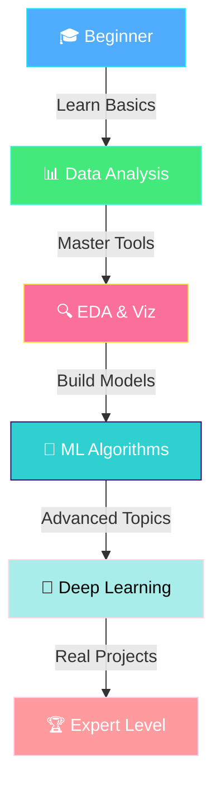

# 🚀 Data Science & Machine Learning Projects

<div align="center">

<!-- Animated Banner -->


<br/>

<!-- Badges -->
<p align="center">
  
  
  
  
  
  
</p>

<p align="center">
  <a href="#-projects"></a>
  <a href="#-learning-path"></a>
  <a href="#-getting-started"></a>
  <a href="#-resources"></a>
  <a href="#-contributing"></a>
</p>

<h3>🎯 A Comprehensive Collection of Data Science & ML Projects</h3>
<h4>Designed for beginners to advance their skills through hands-on practice</h4>

</div>

---

<br/>

## 📖 About This Repository

<table>
<tr>
<td width="60%">

Welcome to **DS-ML-Projects** - your journey from beginner to advanced data scientist! This repository contains a carefully curated collection of **hands-on projects** that progressively build your skills in data science and machine learning.

### 🎯 What Makes This Special?

- 📚 **Progressive Learning**: Projects ordered from basic to advanced
- 💡 **Practical Focus**: Real-world datasets and problems
- 📊 **Comprehensive Coverage**: From data analysis to deep learning
- 🎓 **Educational**: Detailed explanations and comments
- 🔄 **Constantly Updated**: New projects added regularly

### ✨ Perfect For

✅ Students starting their DS/ML journey  
✅ Professionals transitioning to data science  
✅ Developers wanting hands-on ML experience  
✅ Anyone building their portfolio  

</td>
<td width="40%">



</td>
</tr>
</table>

---

<br/>

## 📚 Projects Overview

<div align="center">

### 🎯 Current Projects

<table>
<tr>
<td align="center" width="33%">

<br/>
<h3>🏥 Diabetes Prediction</h3>
<sub><b>Difficulty:</b> ⭐⭐⭐</sub>
<br/><br/>
<p align="left">
<b>📋 Description:</b><br/>
Predict diabetes occurrence using patient health metrics with machine learning classification algorithms.
<br/><br/>
<b>🔧 Technologies:</b><br/>
• Python, Pandas, NumPy<br/>
• Scikit-Learn<br/>
• Matplotlib, Seaborn<br/>
• Jupyter Notebook
<br/><br/>
<b>🎯 Key Concepts:</b><br/>
• Data preprocessing<br/>
• Feature engineering<br/>
• Classification models<br/>
• Model evaluation<br/>
• Cross-validation
<br/><br/>
<b>📊 Dataset:</b> Pima Indians Diabetes
</p>
</td>
<td align="center" width="33%">

<br/>
<h3>🔜 Coming Soon</h3>
<sub><b>Next Project</b></sub>
<br/><br/>
<p align="left">
<b>📋 Planned Projects:</b><br/>
• House Price Prediction<br/>
• Customer Segmentation<br/>
• Sentiment Analysis<br/>
• Image Classification<br/>
• Time Series Forecasting<br/>
• Recommendation System<br/>
• NLP Text Generation<br/>
• Computer Vision Tasks
<br/><br/>
Stay tuned for updates! ⭐
</p>
</td>
<td align="center" width="33%">

<br/>
<h3>💡 Suggest a Project</h3>
<sub><b>We're Open to Ideas!</b></sub>
<br/><br/>
<p align="left">
<b>🎯 Want to See?</b><br/>
Have a project idea you'd like to see implemented? 
<br/><br/>
<b>How to Suggest:</b><br/>
1. Open an issue<br/>
2. Describe the project<br/>
3. Mention datasets<br/>
4. Explain use cases
<br/><br/>
<a href="https://github.com/DeepMind-Craft/DS-ML-projects/issues">

</a>
</p>
</td>
</tr>
</table>

</div>

---

<br/>

## 🎓 Learning Path

<div align="center">

<table>
<tr>
<td align="center" width="20%">
<br/>
<h3>Level 1</h3>
<b>🌱 Beginner</b><br/>
<sub>0-3 months</sub>
<hr/>
<p align="left">
<b>Topics:</b><br/>
• Python basics<br/>
• Pandas & NumPy<br/>
• Data visualization<br/>
• Basic statistics<br/>
• Jupyter notebooks
<br/><br/>
<b>Projects:</b><br/>
• Data cleaning<br/>
• EDA exercises<br/>
• Simple predictions
</p>
</td>
<td align="center" width="20%">
<br/>
<h3>Level 2</h3>
<b>📚 Intermediate</b><br/>
<sub>3-6 months</sub>
<hr/>
<p align="left">
<b>Topics:</b><br/>
• ML algorithms<br/>
• Feature engineering<br/>
• Model evaluation<br/>
• Cross-validation<br/>
• Scikit-Learn
<br/><br/>
<b>Projects:</b><br/>
✅ Diabetes prediction<br/>
• House prices<br/>
• Classification tasks
</p>
</td>
<td align="center" width="20%">
<br/>
<h3>Level 3</h3>
<b>🚀 Advanced</b><br/>
<sub>6-12 months</sub>
<hr/>
<p align="left">
<b>Topics:</b><br/>
• Deep learning<br/>
• Neural networks<br/>
• NLP & CV<br/>
• Model optimization<br/>
• TensorFlow/PyTorch
<br/><br/>
<b>Projects:</b><br/>
• Image recognition<br/>
• Text generation<br/>
• Time series
</p>
</td>
<td align="center" width="20%">
<br/>
<h3>Level 4</h3>
<b>🏆 Expert</b><br/>
<sub>12+ months</sub>
<hr/>
<p align="left">
<b>Topics:</b><br/>
• Production ML<br/>
• MLOps<br/>
• Model deployment<br/>
• Big data tools<br/>
• Cloud platforms
<br/><br/>
<b>Projects:</b><br/>
• End-to-end systems<br/>
• Real-time ML<br/>
• Scalable solutions
</p>
</td>
<td align="center" width="20%">
<br/>
<h3>Level 5</h3>
<b>🌟 Master</b><br/>
<sub>Career-Ready</sub>
<hr/>
<p align="left">
<b>Topics:</b><br/>
• Research papers<br/>
• Custom models<br/>
• Architecture design<br/>
• Team leadership<br/>
• Innovation
<br/><br/>
<b>Projects:</b><br/>
• Novel solutions<br/>
• Publications<br/>
• Open source
</p>
</td>
</tr>
</table>

</div>

---

<br/>

## 🚀 Getting Started

<div align="center">

### Prerequisites

<table>
<tr>
<td align="center" width="25%">
<br/>
<b>Python 3.8+</b><br/>
<sub>Core language</sub>
</td>
<td align="center" width="25%">
<br/>
<b>Anaconda</b><br/>
<sub>Recommended</sub>
</td>
<td align="center" width="25%">
<br/>
<b>Jupyter</b><br/>
<sub>Notebook environment</sub>
</td>
<td align="center" width="25%">
<br/>
<b>IDE</b><br/>
<sub>VS Code/PyCharm</sub>
</td>
</tr>
</table>

</div>

<br/>

### 📥 Installation

<table>
<tr>
<td>

**Step 1️⃣: Clone the Repository**
```bash
git clone https://github.com/DeepMind-Craft/DS-ML-projects.git
cd DS-ML-projects
```

**Step 2️⃣: Create Virtual Environment (Optional)**
```bash
# Using conda
conda create -n ds-ml python=3.8
conda activate ds-ml

# Using venv
python -m venv env
source env/bin/activate  # On Windows: env\Scripts\activate
```

**Step 3️⃣: Install Dependencies**
```bash
pip install numpy pandas scikit-learn matplotlib seaborn jupyter
```

**Step 4️⃣: Launch Jupyter Notebook**
```bash
jupyter notebook
```

**Step 5️⃣: Start Learning! 🎉**
Open any `.ipynb` file and start coding!

</td>
</tr>
</table>

---

<br/>

## 🛠️ Technologies & Tools

<div align="center">

### Core Libraries

<table>
<tr>
<td align="center" width="16.66%">
<br/>
<b>NumPy</b><br/>
<sub>Numerical computing</sub>
</td>
<td align="center" width="16.66%">
<br/>
<b>Pandas</b><br/>
<sub>Data manipulation</sub>
</td>
<td align="center" width="16.66%">
<br/>
<b>Scikit-Learn</b><br/>
<sub>Machine learning</sub>
</td>
<td align="center" width="16.66%">
<br/>
<b>Matplotlib</b><br/>
<sub>Visualization</sub>
</td>
<td align="center" width="16.66%">
<br/>
<b>Seaborn</b><br/>
<sub>Statistical plots</sub>
</td>
<td align="center" width="16.66%">
<br/>
<b>Jupyter</b><br/>
<sub>Interactive coding</sub>
</td>
</tr>
</table>

### Advanced Libraries (Coming Soon)

<table>
<tr>
<td align="center" width="25%">
<br/>
<b>TensorFlow</b>
</td>
<td align="center" width="25%">
<br/>
<b>PyTorch</b>
</td>
<td align="center" width="25%">
<br/>
<b>OpenCV</b>
</td>
<td align="center" width="25%">
<br/>
<b>Cloud ML</b>
</td>
</tr>
</table>

</div>

---

<br/>

## 💡 Project Structure

Each project follows a consistent structure for easy learning:

```
📦 Project Name/
├── 📓 notebook.ipynb          # Main Jupyter notebook
├── 📊 data/                   # Dataset files
│   ├── raw/                   # Original data
│   └── processed/             # Cleaned data
├── 📸 images/                 # Visualizations & plots
├── 🔧 scripts/                # Helper Python scripts
├── 📋 requirements.txt        # Dependencies
└── 📖 README.md              # Project documentation
```

### 📋 Standard Notebook Sections

<table>
<tr>
<td align="center" width="20%">
<br/>
<b>1. Introduction</b><br/>
<sub>Problem statement<br/>& objectives</sub>
</td>
<td align="center" width="20%">
<br/>
<b>2. Data Import</b><br/>
<sub>Loading &<br/>understanding data</sub>
</td>
<td align="center" width="20%">
<br/>
<b>3. Data Cleaning</b><br/>
<sub>Handling missing<br/>values & outliers</sub>
</td>
<td align="center" width="20%">
<br/>
<b>4. EDA</b><br/>
<sub>Exploratory analysis<br/>& visualization</sub>
</td>
<td align="center" width="20%">
<br/>
<b>5. Modeling</b><br/>
<sub>Training &<br/>evaluation</sub>
</td>
</tr>
</table>

---

<br/>

## 📊 Skills You'll Learn

<div align="center">

<table>
<tr>
<td width="33%" valign="top">

### 🔍 Data Analysis
 Data cleaning & preprocessing  
 Exploratory data analysis  
 Statistical analysis  
 Feature engineering  
 Data transformation  
 Handling missing data  
 Outlier detection  

</td>
<td width="33%" valign="top">

### 🤖 Machine Learning
 Supervised learning  
 Unsupervised learning  
 Classification algorithms  
 Regression techniques  
 Model evaluation  
 Hyperparameter tuning  
 Cross-validation  

</td>
<td width="33%" valign="top">

### 📈 Visualization
 Matplotlib plotting  
 Seaborn statistical plots  
 Interactive dashboards  
 Data storytelling  
 Chart customization  
 Report generation  
 Presentation skills  

</td>
</tr>
</table>

</div>

---

<br/>

## 📖 Resources

<details open>
<summary><b>📚 Recommended Books</b></summary>
<br/>

| Book | Author | Level | Topics |
|------|--------|-------|--------|
| 🐍 Python for Data Analysis | Wes McKinney | Beginner | Pandas, NumPy |
| 🤖 Hands-On Machine Learning | Aurélien Géron | Intermediate | Scikit-Learn, TensorFlow |
| 📊 Introduction to Statistical Learning | James et al. | Intermediate | Statistical ML |
| 🧠 Deep Learning | Ian Goodfellow | Advanced | Neural Networks |
| 📈 Pattern Recognition & ML | Christopher Bishop | Advanced | Theory & Practice |

</details>

<details>
<summary><b>🎥 Video Courses</b></summary>
<br/>

- **🎓 Coursera**: Machine Learning by Andrew Ng
- **📺 YouTube**: StatQuest, 3Blue1Brown, Sentdex
- **🎬 Udacity**: Data Scientist Nanodegree
- **📽️ edX**: MITx Data Science MicroMasters
- **🎞️ DataCamp**: Interactive Python & ML courses

</details>

<details>
<summary><b>🔗 Useful Links</b></summary>
<br/>

<table>
<tr>
<td align="center" width="25%">
<br/>
<b><a href="https://kaggle.com">Kaggle</a></b><br/>
<sub>Datasets & Competitions</sub>
</td>
<td align="center" width="25%">
<br/>
<b><a href="https://github.com/topics/machine-learning">GitHub</a></b><br/>
<sub>Open Source Projects</sub>
</td>
<td align="center" width="25%">
<br/>
<b><a href="https://stackoverflow.com">Stack Overflow</a></b><br/>
<sub>Q&A Community</sub>
</td>
<td align="center" width="25%">
<br/>
<b><a href="https://towardsdatascience.com">Medium</a></b><br/>
<sub>Articles & Tutorials</sub>
</td>
</tr>
</table>

</details>

<details>
<summary><b>🛠️ Tools & Platforms</b></summary>
<br/>

- **☁️ Google Colab**: Free GPU notebooks
- **📓 Jupyter Lab**: Enhanced notebook interface
- **🐍 Anaconda**: Package management
- **🔧 VS Code**: Powerful IDE with extensions
- **🐳 Docker**: Containerized environments
- **☁️ AWS/GCP/Azure**: Cloud ML platforms

</details>

---

<br/>

## 🎯 How to Use This Repository

<table>
<tr>
<td align="center" width="20%">
<br/>
<b>Browse Projects</b><br/>
<sub>Explore available<br/>projects by difficulty</sub>
</td>
<td align="center" width="20%">
<br/>
<b>Pick Your Level</b><br/>
<sub>Start with beginner<br/>or jump to advanced</sub>
</td>
<td align="center" width="20%">
<br/>
<b>Clone & Setup</b><br/>
<sub>Download project<br/>and install dependencies</sub>
</td>
<td align="center" width="20%">
<br/>
<b>Learn & Code</b><br/>
<sub>Follow notebooks<br/>and experiment</sub>
</td>
<td align="center" width="20%">
<br/>
<b>Build Portfolio</b><br/>
<sub>Customize & showcase<br/>your work</sub>
</td>
</tr>
</table>

---

<br/>

## 🤝 Contributing

<div align="center">


### We Love Contributions! ❤️

</div>

<table>
<tr>
<td width="50%">

### 🌟 How to Contribute

1. 🍴 **Fork** the repository
2. 🌿 **Create** a feature branch
   ```bash
   git checkout -b feature/NewProject
   ```
3. 💻 **Add** your project with documentation
4. ✅ **Test** your code thoroughly
5. 💾 **Commit** your changes
   ```bash
   git commit -m 'Add: New ML Project'
   ```
6. 📤 **Push** to your branch
   ```bash
   git push origin feature/NewProject
   ```
7. 🎯 **Open** a Pull Request

</td>
<td width="50%">

### 💡 Contribution Ideas

- 📊 **New Projects**: Add projects with datasets
- 📝 **Documentation**: Improve README files
- 🐛 **Bug Fixes**: Fix errors in notebooks
- 🎨 **Visualizations**: Enhance plots & charts
- 🔧 **Code Quality**: Refactor & optimize
- 📚 **Resources**: Add learning materials
- 🌍 **Translation**: Multi-language support
- ✨ **Features**: Suggest improvements

### 📋 Contribution Guidelines

- Follow consistent notebook structure
- Add detailed comments & markdown
- Include dataset sources & citations
- Test code before submitting
- Write clear commit messages

</td>
</tr>
</table>

---

<br/>

## 🗺️ Roadmap

<table>
<tr>
<td width="25%">

### 🚀 Phase 1 (Q1 2024)
- ✅ Diabetes prediction
- [ ] House price prediction
- [ ] Customer segmentation
- [ ] Sentiment analysis
- [ ] Linear regression projects

</td>
<td width="25%">

### 🎯 Phase 2 (Q2 2024)
- [ ] Image classification
- [ ] NLP projects
- [ ] Time series forecasting
- [ ] Recommendation systems
- [ ] Feature engineering guide

</td>
<td width="25%">

### 🧠 Phase 3 (Q3 2024)
- [ ] Deep learning projects
- [ ] CNN implementations
- [ ] RNN & LSTM projects
- [ ] Transfer learning
- [ ] Model deployment guides

</td>
<td width="25%">

### 🏆 Phase 4 (Q4 2024)
- [ ] End-to-end ML pipelines
- [ ] MLOps practices
- [ ] Production deployment
- [ ] Real-time ML systems
- [ ] Advanced DL architectures

</td>
</tr>
</table>

---

<br/>

## ⭐ Show Your Support

<div align="center">


### If you find this repository helpful, please give it a ⭐!

<p>
<a href="https://github.com/DeepMind-Craft/DS-ML-projects/stargazers">

</a>
<a href="https://github.com/DeepMind-Craft/DS-ML-projects/network/members">

</a>
<a href="https://github.com/DeepMind-Craft/DS-ML-projects/watchers">

</a>
</p>

</div>

---

<br/>

## 📄 License

<div align="center">


This project is licensed under the **GNU General Public License v3.0**

See [LICENSE](
